<h1 align="center">Hi 👋, I'm Mirza Junaid</h1>
<h3 align="center">AI/ML Engineer, Data Engineer, Data Scientist & Full Stack Web Developer</h3>

**Official Profile** : [IITM Profile](https://ds.study.iitm.ac.in/student/22f1000870)

<!-- 

  

  

  

 -->

- 🔭 I’m currently cooking a **Deep Learning Model**

### 🧑🏻‍💻 Cooked Projects so far:

### 1) 🤖 MCQ Solver — Domain-Specific Transformer-Based Question Answering System

A domain-specific **MCQ Solver** powered by a fine-tuned **RoBERTa Transformer model**, designed to understand questions, identify relevant concepts, and predict the most appropriate answer.

- Fine-tuned **RoBERTa Transformer architecture**
- Domain-specific NLP and question understanding
- Context-aware text representation using Transformers
- Designed for solving structured multiple-choice questions
- Custom training and evaluation pipeline
- Domain-specific answer prediction

🚀 **Use the trained model:** [My Trained Model](https://mcq-app-mirza.streamlit.app/)

**IIT MADRAS**

**Best Grade in a Deep Learning and GenAI Project**

**Course:** Deep Learning and Generative AI - Project

Received a best grade of **S** in a Deep Learning and Generative AI Project in the BS in Data Science and Applications Program.

---

### 2) 💬 Comment Category Prediction Challenge

A machine learning ensemble system developed for **automatically predicting comment categories** using a stacking-based architecture.

The final prediction system combines **XGBoost, Logistic Regression, and a Logistic Regression Meta-Learner**:

- **XGBoost** as the nonlinear base learner
- **Logistic Regression (LR)** as the linear base learner
- **Logistic Regression Meta-Learner** to combine predictions from the base models
- Stacking-based ensemble architecture for improved generalization

**Architecture:**

`XGBoost + Logistic Regression → Logistic Regression Meta-Learner`

**IIT MADRAS**

**Best Grade in a Machine Learning Project**

Received a best grade of **S** in a Machine Learning Project in the BS in Data Science and Applications Program.

---

### 3) 🚗 Vehicle Parking Application

(Decoupled Front-end, Back-end and Asynchronous Batch Jobs)

(Distributed Architecture)

**IIT MADRAS**

**Best Grades in Modern Application Development Capstone Project**

**Course:** Modern Application Development II - Project

Received a best grade of **S** in a Programming Course in the BS in Data Science and Applications Program.

**Tech Stack:**

- **Celery** and **Flask-Mail** for asynchronous jobs
- **Redis** for caching
- **Flask** for REST APIs
- **Vue 3** for Front-end
- Distributed application architecture

---

### 4) 💃🏻 Influencer Engagement and Sponsorship Co-ordination Platform

(Tightly coupled Front-end and Back-end using **Flask**)

**IIT MADRAS**

**Best Grades in Modern Application Development Capstone Project**

**Course:** Modern Application Development I - Project

Received a best grade of **S** in a Programming Course in the BS in Data Science and Applications Program.

---

- 🌱 I’m currently learning **Deep Learning and GenAI**

- 💬 Ask me about **Artificial Intelligence**

<h3 align="left">Connect with me:</h3>

  

<h3 align="left">Languages and Tools:</h3>

  

  

  &nbsp;
  

  

